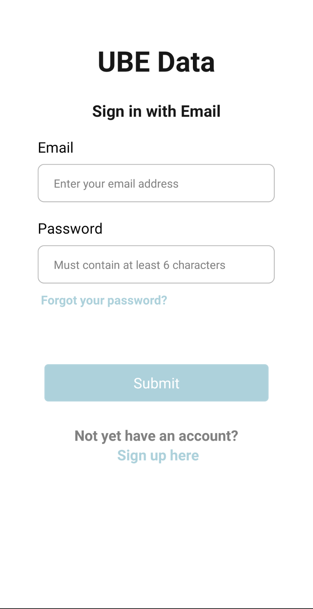
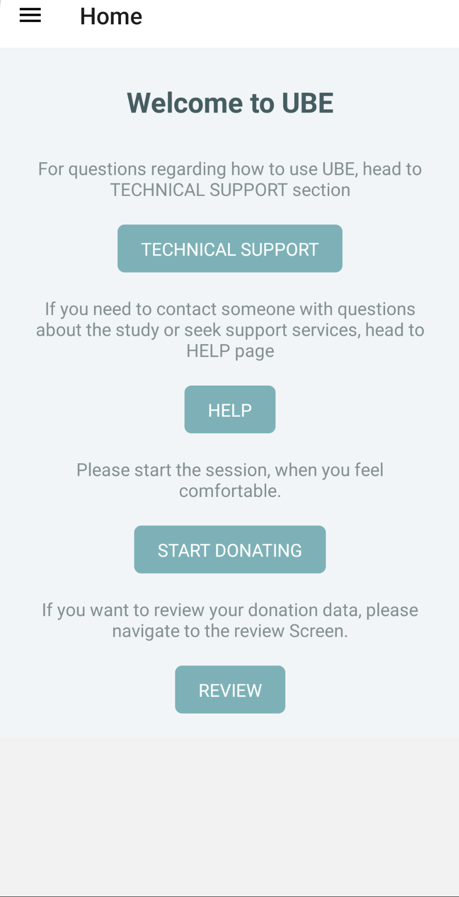
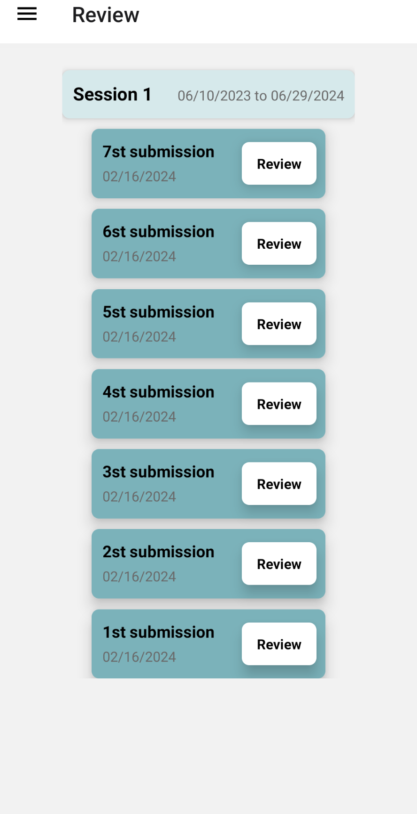

# UBE-Donator app
The **UBE Donator** is open-source software developed with support from NSF grant #2211897. This project aims to improve our understanding of how online interactions lead to real-world sexual violence by examining how digital communication shapes the exchange and interpretation of sexual consent. The UBE Donator app supports large-scale, privacy-preserving data collection by following best practices for reporting sexual experiences. It provides researchers with a reliable, ethical way to study harm in computer-mediated settings.

<p align="center">
  
  
  
</p>
 
## Getting Started
Follow these steps to install, build, and run the UBE Donator app on Android.

### Prerequisites
**1. Node.js & npm**
- Ensure you have Node.js (>=14.x) and npm installed.
- Check versions:
```bash
node --version
npm --version
```
**2. Java Development Kit (JDK)**
- Install JDK 11 or newer.
- Make sure JAVA_HOME is set in your environment.
  
**3. Android Studio & SDK**
- Install Android Studio (Arctic Fox or later).
- From the SDK Manager, install:
  - Android SDK Platform 30 (Android 10.0)
  - Android SDK Build-Tools (version 30.0.3 or later)
  - Android Virtual Device (AVD) for Android 10

### Step 1: Install JavaScript Dependencies
From your project root, run:
```bash
npm i
```
This installs all required packages listed in package.json.
### Step 2: Configure & Build the Android Project 
**1. Open Android Studio**
- Select Open an existing Android Studio project.
- Navigate to your project’s android/ folder and open it.
**2. Sync & Clean**
- In the toolbar: File → Sync Project with Gradle Files.
- Then: Build → Clean Project.
**3. Rebuild**
- Finally: Build → Rebuild Project.
- Verify there are no errors.
### Step 3: Create & Launch an Android 10 Emulator
**1. Open AVD Manager**
- In Android Studio: Tools → AVD Manager.
**2. Create Virtual Device**
- Choose a device definition (e.g., Pixel 4).
- Select Android 10.0 (API Level 29) system image.
- Finish the setup and launch the emulator.
### Step 4: Run the App on Your Emulator or Device
With your emulator running, execute:
```bash
npx react-native run-android
```
This will compile the native code and install the APK on the target device.
